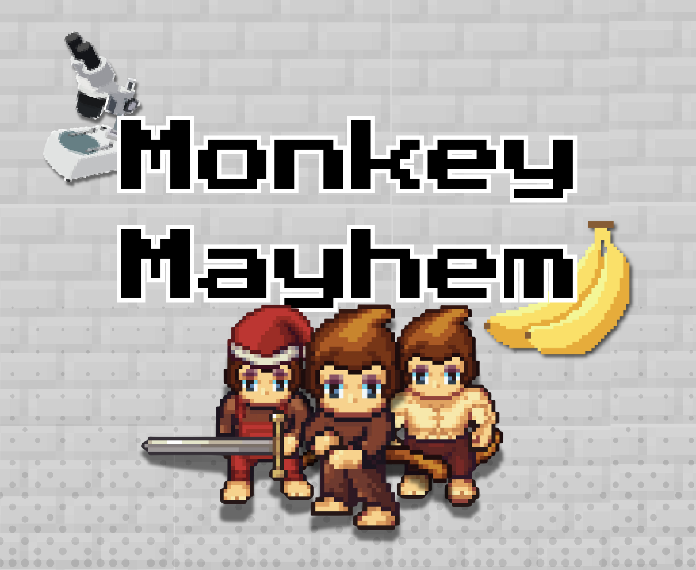

# 43Monkeys

In-development 2D pixel art rogue-like game made with Godot for COMP 460: Video
Game Design at Rice University.

  

## Overview

- A 2D top-down roguelike where players lead a growing squad of experimental
  monkeys escaping a high-tech science facility.
- Start as a lone monkey and battle through procedurally generated levels,
  rescuing monkeys with unique abilities to build a diverse, strategic squad.
- Find team upgrades to discover synergies and unlock powerful combo abilities,
  rewarding creative strategies!
- Beware—once a monkey runs out of health, it’s gone forever.
- Ascend through themed floors, face the mastermind scientist, and lead your
  monkey squad to freedom!

## Project Structure

| Directory  | Description                                  |
| ---------- | -------------------------------------------- |
| `assets/`  | Contains all the assets used in the game.    |
| `scenes/`  | Contains all the scenes used in the game.    |
| `scripts/` | Contains all the scripts used in the game.   |
| `addons/`  | Extermnal Godot plugins used in the game.    |
| `docs/`    | Contains all the documentation for the game. |
