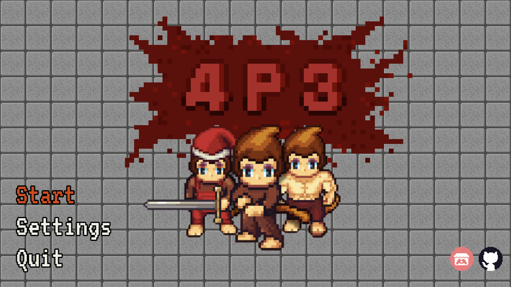

# 43 Monkeys

<div align="center">
  <p>
    
    
    
  </p>
</div>

A 2D pixel art rogue-like game made with the
[Godot Engine](https://godotengine.org/) for <em>COMP 460: Video Game
Design</em> at Rice University. The game blends strategic squad-building with
permadeath mechanics in a high-stakes escape scenario set in a futuristic
science facility.

<div align="center">
  
</div>

## Overview

In **43 Monkeys**, players begin as a single experimental monkey breaking out of
a high-security laboratory. As the game progresses, players explore
procedurally-curated floors, liberate other genetically-enhanced monkeys with
unique abilities, and battle scientists, mutants, and facility defenses.

The gameplay combines real-time combat, permadeath, and squad management in a
linear progression of themed environments. Each run presents meaningful
decisions about resource allocation, team composition, and risk-reward
trade-offs.

## Installation

To run **43 Monkeys** locally:

### Requirements

- [Godot Engine 4.4](https://godotengine.org/download)
- Git (optional but recommended)

### Steps

1. **Clone the repository:**

   ```bash
   git clone https://github.com/micahkepe/43-monkeys.git
   cd 43-monkeys
   ```

2. **Open in Godot**

- Launch the Godot editor.
- Click “Import Project”.
- Navigate to the project directory and select.

3. **Run the game**:

- In the open project, hit "Run Project" in the top left corner of the editor.

## 🔮 Roadmap/ Future Features

- [ ] Player inventory/ability pickups

  - Inventory (active items, powerups, etc.)
  - Temporary monkey shields
  - Healing
  - Ability where monkeys swarm and kill enemy, then return
  - Zap attack
  - Trade off abilities (half damage double health, etc.)

- [ ] Monkey biographies menu - Display more lore behind the other monkey variants

- [ ] Exposition notes pickups (e.g., clipboards, recordings, etc.)

  - Character biography notes
  - Internal corporate notes

- [ ] Door mechanics

## License

This repository is licensed under a GPL-3.0 license, see [LICENSE](./LICENSE)
for details.

## Primary Contributors

<a href="https://github.com/GrantWT16"></a>
<a href="https://github.com/zachkepe"></a>
<a href="https://github.com/klei04"></a>
<a href="https://github.com/micahkepe"></a>
